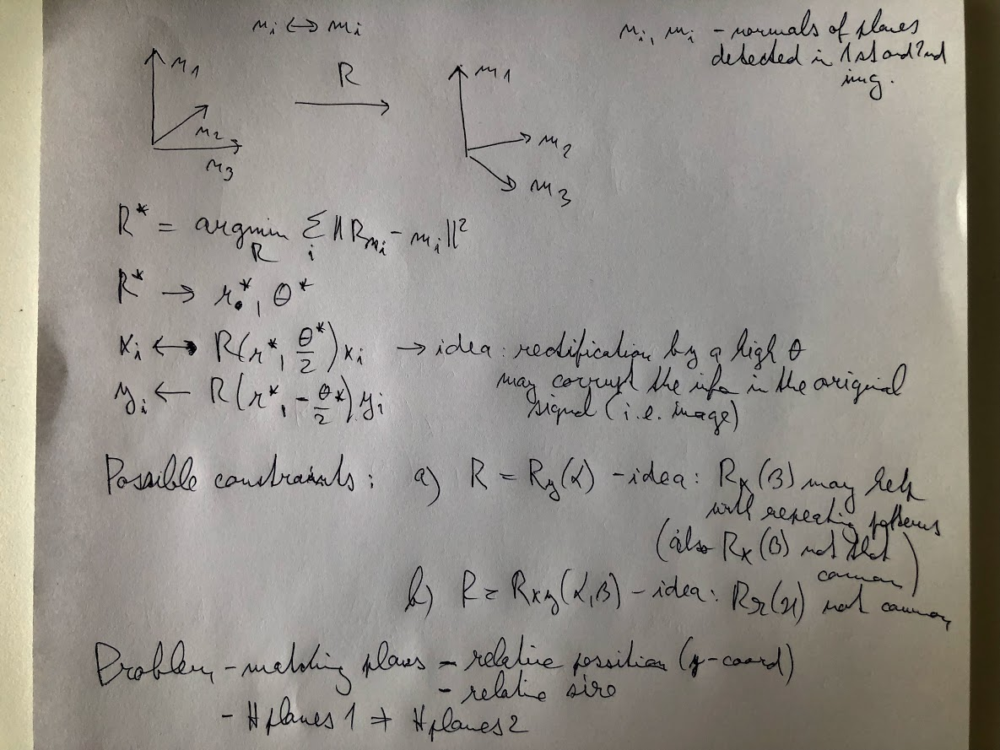

# Backlog - plan

### Key idea - isolate the stages

Try the next stage (normal estimation, clustering) with GT input from the previous stage. The performance if the various stages can be tuned independently.
 
  
### Depth estimation  
 * how good does the CNN estimate the depth 
   * try on some dataset with ground truth (MegaDepth DS, COLMAP) - is there any bias in the plane directions normals 
   * does to error follow correspond to some probabilistic model
 * rather low priority
 * try synthetic / GT data for depth maps as the input to the next stage
    

### Normals estimation & clustering  
 * normals estimation - robustness to local noise 
 * normals clustering - robustness to local noise + capture spatial structure (clustering, connected components)
   * plane normals detection x plane patches detection     
   * bilateral filter 
     * can help to include also parts of the projected planes noisy in the depth data
     * or may even detect whole general surfaces with smooth normals - cupola in St. Peters square
   * mean-shift - (planes' normals estimation already reasonably good)
   * how does enforcing the orthogonality help (to estimate the normals x the matching) 
 * my current focus 
   * parameters tuning - bayesian optimization / probabilistic model (informed manual grid search for now)

### Features rectification & matching 
   * probably most important & potentially creative
   * even if all previous steps are correct, how well does it serve to matching - key concern
   * observe metrics and save (tentatives, #inliers, #inlier ratio, correspondence between plane1(t1) <-> plane2(t2) on all tentatives)  
   * modification of the rectifications
     * idea: rectify only partly
        * rotate only by c.&#945; c &#8712; (0, 1), &#945; is the rectification rotation angle 
        * rotate by half of the rotation which would align the detected normals - many variants (around 1,2,3 axes)
        * others (e.g. use the estimated dR from matching for the rectification and loop back) - this actually may not need the depth at all
   * modifications to the matching 
     * add also the unrectified keypoints on the detected planes
   * ASIFT
   * things already identified - "scaling" by the rectification,  clipping angle
 

